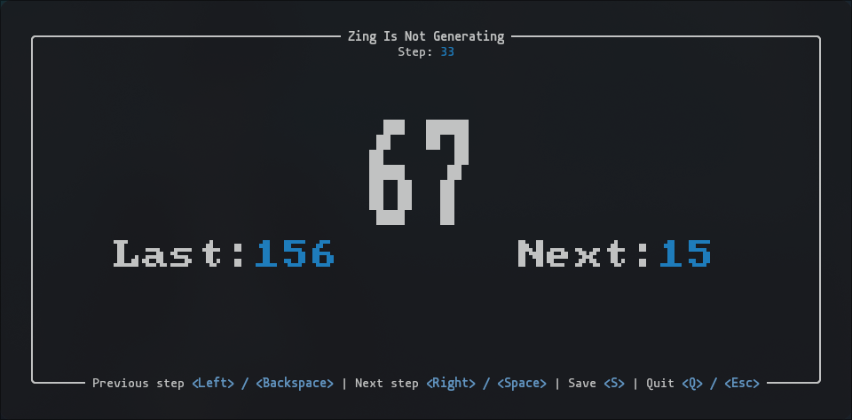
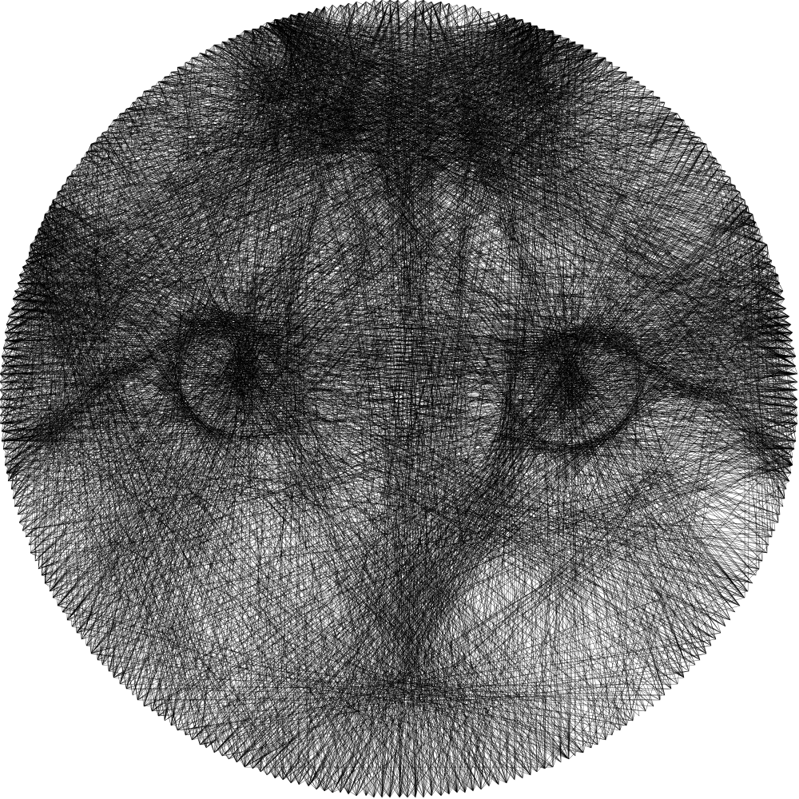

# ZING



## What is this?

Zing is a TUI (Text User Interface) designed for the execution phase of string art.

The name comes from two places:

1. The acronym: **Zing Is Not Generating**.
2. The sound a thread makes when it snaps `/zing/`.

It does not calculate algorithms. It does not turn photographs into nail patterns. It simply holds the map while you drive.



## Why use it?

When you are doing string art, your hands and your mind are busy. You cannot be struggling with a complex GUI.

Zing takes a comma-separated sequence of numbers (the nail numbers) and displays them one by one on a terminal using big, readable text.

It also previews the previous and next steps so you can maintain flow.

## Installation

You can install Zing using pre-built binaries or compile it from source.

### Automated Install (Recommended)

#### Linux & macOS

Run the following in your terminal to download and install the latest release

```bash
curl --proto '=https' --tlsv1.2 -LsSf https://github.com/000Volk000/zing/releases/latest/download/zing-art-installer.sh | sh
```

#### Windows

Run this in PowerShell

```PowerShell
irm https://github.com/000Volk000/zing/releases/latest/download/zing-art-installer.ps1 | iex
```

### Package Managers

#### Homebrew

```bash
brew install 000Volk000/zing/zing-art
```

### From Source

If you have [Rust](https://rust-lang.org/) installed, you can get it directly from [crates.io](https://crates.io/):

```bash
cargo install zing-art
```

Or build it from the repository:

```bash
git clone https://github.com/000Volk000/zing.git
cd zing
cargo install --path .
```

## Usage

Feed it a sequence.

You can feed it any plain text file. The extension does not matter, but the structure does.

```bash
zing-art pattern.txt
```

### Important Data Rules

1. **Single Line Input:** Your sequence of numbers must be entirely on the **first line** (separated by commas) of the file.
2. **File Modification:** Zing will write to the **second line** to save your current progress.

### Example file

```plaintext
0,105,238,104,239,106,197,99,194,54,167,47,166,46,165,45,164
```

## Controls

- `SPACE` / `RIGHT` : Next step.
- `BACKSPACE` / `LEFT` : Go back.
- `s` : Save current position.
- `q` / `ESCAPE` : Quit.

> [!IMPORTANT]
> Zing attempts to auto-save your progress when you quit.<br>If saving fails, it will warn you before closing.

## The Philosophy

Generators are for planning. Zing is for making.

The software stays out of your way. No distractions. Just the number you need to hit next.

## License

Created under the MIT License. See [LICENSE](https://github.com/000Volk000/zing/blob/main/LICENSE) for more information.

Created by [Darío Martínez Kostyuk](https://linktree.volkhost.es/) - 2025
